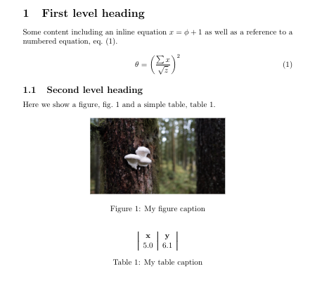
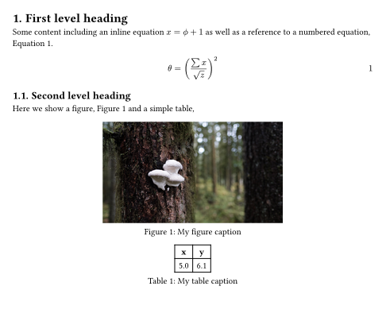

## Estimates are about time, not effort

The author of the linked article argues that there is a time and place where Agile story-points are sensible but that they're overused. Instead, estimation should be done in time. I've been doing story-point related estimation for a number of years now and I agree with many of the points they're making.

In the last section, they discuss situations when estimating in time is problematic too. One that stood out to me is that the estimate becomes tied to the person - we don't all work at the same rate. They say this is a problem if your Agile setup means tasks are shuffled around between workers.

This article has me thinking about alternative ways to estimate. Shoot me a message if you have any ideas or insight on the matter!

Article: <https://ntietz.com/blog/estimate-in-time>

## Typst

I really thought I had written about this a while back but apparently not. Typst ([pronunciation](https://github.com/typst/typst#pronunciation-and-spelling)) is offering an alternative to LaTeX.

I've set up a comparison. I wrote up a basic section of text that covers a large percent of my normal use cases (equations, figures and tables) in LaTeX then recreated it in Typst. Lets see how it looks.

### LaTeX demo

The actual contents, including frontmatter, is:

```latex
\documentclass{article}
\usepackage{graphicx}
\usepackage{cleveref}

\begin{document}

\section{First level heading}
Some content including an inline equation $x=\phi+1$ as well as a reference to a numbered equation, \cref{eq:demo}.

\begin{equation}
    \theta = \left(\frac{\sum{x}}{\sqrt{z}}\right)^2
    \label{eq:demo}
\end{equation}

\subsection{Second level heading}
Here we show a figure, \cref{fig:demo} and a simple table, \cref{tab:demo}.

\begin{figure}[h]
    \centering
    \includegraphics[width=0.5\linewidth]{demo.jpg}
    \caption{My figure caption}
    \label{fig:demo}
\end{figure}


\begin{table}[h]
    \centering
    \begin{tabular}{|c|c|}
        \textbf{x} & \textbf{y} \\
         5.0 & 6.1 \\
    \end{tabular}
    \caption{My table caption}
    \label{tab:demo}
\end{table}

\end{document}

```

Which results in the following page (which I cropped for convenience).



### Typst demo

The roughly equivalent output is obtained in Typst with the following (note that at the time of this writing my syntax highlighter doesn't support Typst so it's doing `sh` highlighting).

```sh
#set math.equation(numbering: "1")
#set heading(numbering: "1.")

= First level heading <first-level-heading>
Some content including an inline equation $x eq phi.alt plus 1$ as well as a reference to a numbered equation, @eq:demo.

$ theta eq lr((frac(sum x, sqrt(z))))^2 $ <eq:demo>

== Second level heading <second-level-heading>
Here we show a figure, @fig:demo and a simple table,

#figure(
  image("demo.jpg", width: 50%),
  caption: "My figure caption"
) <fig:demo>

#figure(
  table(
    columns: 2,
    rows: 2,
        [*x*],[*y*],
        [5.0],[6.1],
  ),
  caption: "My table caption"
)
```

Which results in the following page (again cropped for convenience).



### Conclusion

Typst is pretty slick. It's really fast since it was written (well, apparently) in Rust. This is evident using their online editor [typst.app](https://typst.app) which feels similar to Overleaf but rebuilds the document on each keystroke.

The obvious downside to Typst is that it doesn't have all of academia using it. Journals probably aren't about to start accepting `.typ` files. I hope it gains more traction!

Repo: <https://github.com/typst/typst>
